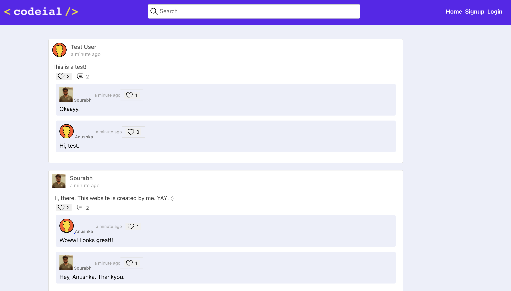
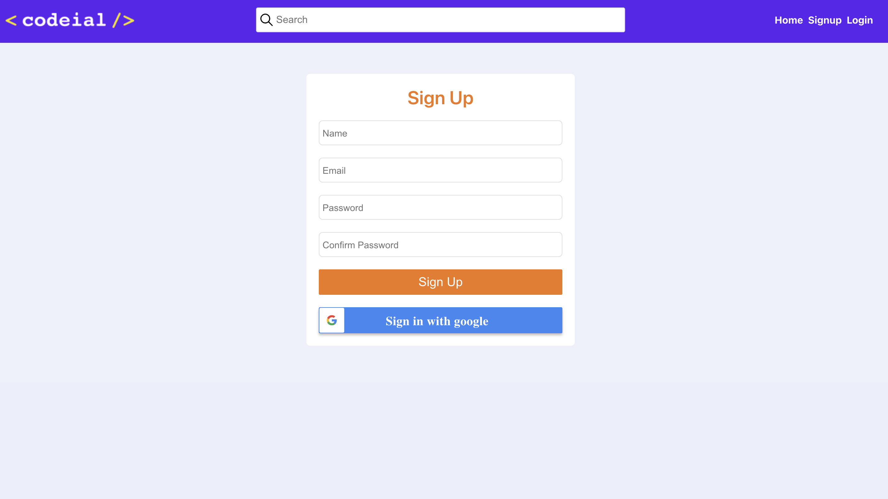

# CODEIAL (SOCIAL NETWORKING WEBSITE)

## Live Application URL

The Application is deployed in <big>[http://codeial.xyz](http://codeial.xyz)</big>

## A Social Networking website where user can:

- Login/Logout via signing up or using google oAuth
- Add a post/comment
- Like a post/comment
- Add a friend
- Upload profile picture
- Chat with eveyone

### Home Page



### Signup Page



## Prerequisites

### Install Node JS

Refer to https://nodejs.org/en/ to install nodejs

## Cloning and Running the Application in local

Clone the project into local

Install all the npm packages. Go into the project folder and type the following command to install all npm packages

```bash
npm install
```

In order to run the application Type the following command

```bash
npm start
```
